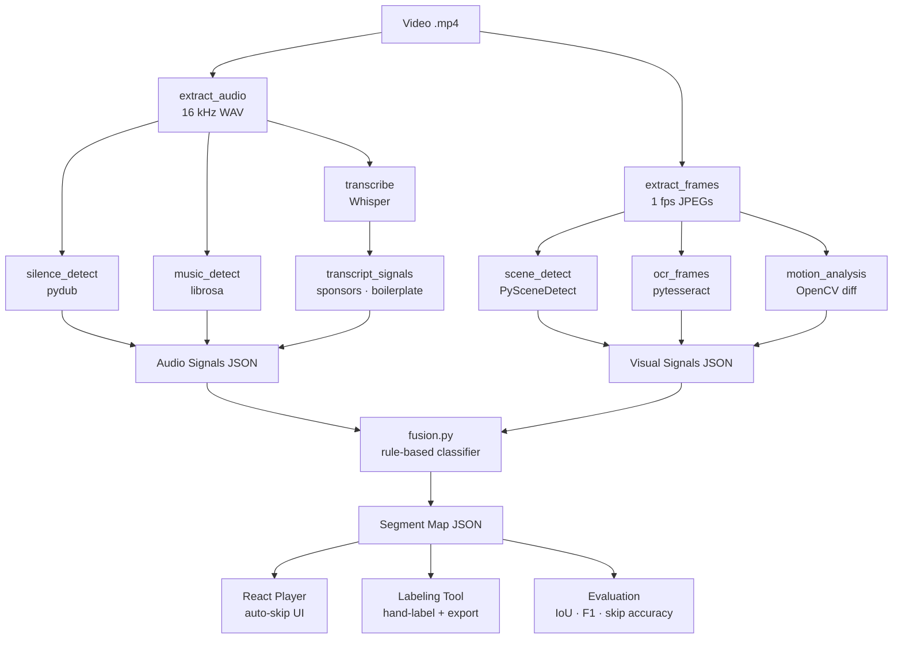

# content-map-generator

Automatically detect and skip non-content segments (intros, sponsor reads, outros, dead air) in long-form YouTube videos. Drop in a video, get a JSON segment map, load it in the custom player — done.

---

## Architecture



---

## Setup

### System dependencies

**macOS**
```bash
brew install tesseract ffmpeg
```

**Linux (Debian/Ubuntu)**
```bash
sudo apt install tesseract-ocr ffmpeg
```

### Python environment

```bash
make setup
source .venv/bin/activate
```

---

## End-to-end example

```bash
# 1. Download a sample video
make download-samples

# 2. Run the full pipeline
make analyze VIDEO=data/videos/lex_fridman_ep400.mp4

# Output: data/predictions/lex_fridman_ep400.json

# 3. Open the player
make player
# → http://localhost:5173
# Load the video and the generated JSON via the file pickers in the UI

# 4. (Optional) Hand-label a video
make label
# → http://localhost:5174

# 5. Evaluate auto-predictions against a hand-labeled ground truth
make eval VIDEO_ID=lex_fridman_ep400
```

---

## Player screenshot

> *Screenshot placeholder — add after Phase 2 is complete.*

---

## Segment JSON format

```json
{
  "video_id": "lex_fridman_ep400",
  "duration_seconds": 9240,
  "generated_at": "2024-05-01T12:00:00Z",
  "segments": [
    {
      "start": 0,
      "end": 42,
      "label": "intro",
      "confidence": 0.91,
      "skip_recommended": true,
      "reason": "Music + boilerplate greeting near video start",
      "signals_used": ["music_intervals", "boilerplate_phrases"]
    },
    {
      "start": 42,
      "end": 9180,
      "label": "main_content",
      "confidence": 0.6,
      "skip_recommended": false,
      "reason": "Default classification",
      "signals_used": []
    }
  ]
}
```

Full schema: [`schemas/segment_schema.json`](schemas/segment_schema.json)

---

## Project structure

```
content-map-generator/
├── analyzer/
│   ├── audio/          # extract_audio, transcribe, silence, music, transcript_signals
│   ├── visual/         # extract_frames, scene_detect, ocr_frames, motion_analysis
│   ├── fusion.py       # rule-based segment classifier
│   ├── fusion_rules.yaml
│   └── pipeline.py     # top-level orchestrator
├── player/             # React + Vite + TypeScript player
├── labeling_tool/      # React labeling UI
├── evaluation/         # metrics.py, compare.py
├── schemas/            # segment_schema.json, signal_schema.json
├── scripts/            # download_sample_videos.py, videos.yaml
├── tests/
├── data/
│   ├── videos/         # raw .mp4 files (gitignored)
│   ├── intermediate/   # cached audio, frames, transcripts (gitignored)
│   ├── ground_truth/   # hand-labeled JSON
│   └── predictions/    # auto-generated JSON
└── Makefile
```

---

## Make targets

| Target | Description |
|---|---|
| `make setup` | Create `.venv` and install Python deps |
| `make download-samples` | Download all videos in `scripts/videos.yaml` |
| `make analyze VIDEO=path` | Run the full pipeline on a video |
| `make eval VIDEO_ID=name` | Compare GT vs predictions, show metrics |
| `make player` | Start the React player dev server |
| `make label` | Start the labeling tool dev server |
| `make test` | Run pytest suite |
| `make lint` | Syntax-check all Python modules |
